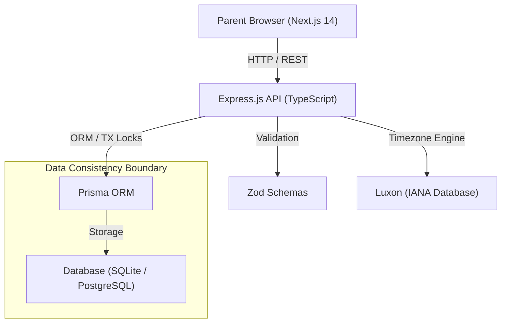

# System Architecture & Technical Design

## 1. Executive Overview

The Codeyoung Appointment-Booking Platform provides parents with an intuitive, reliable interface to schedule free 1-on-1 trial coding classes for their children with expert mentors in India Standard Time (IST).

The architecture is built to solve core distributed scheduling challenges:
- **Timezone & DST Safety**: Seamless cross-timezone conversions across US, UK, Europe, and Asia without fixed UTC offset drift.
- **Mentor Capacity Constraints**: Hard daily caps (maximum 2 demo classes per mentor per IST day) enforced at both query and transaction layers.
- **Concurrency & Double-Booking Prevention**: Database-level serializable isolation and interactive transaction rollbacks guaranteeing that multiple parents booking simultaneously never corrupt mentor allocation or double-book slots.

---

## 2. High-Level Architecture Diagram

---

## 3. Data Model

### Mentor Entity
- `id`: Unique identifier (CUID)
- `name`: Mentor full name
- `email`: Mentor email (unique)
- `timezone`: Default `Asia/Kolkata`
- `createdAt`: Timestamp

### Booking Entity
- `id`: Unique booking identifier (CUID)
- `mentorId`: Foreign key to Mentor
- `parentName`: Name of parent booking the session
- `parentEmail`: Contact email of parent
- `parentTz`: Parent's local IANA timezone identifier (e.g., `America/New_York`)
- `slotUtc`: Exact start time stored in UTC ISO format
- `classLink`: Generated trial class video conference URL
- `status`: Booking state (`CONFIRMED` | `CANCELLED`)
- `createdAt`: Timestamp

---

## 4. Concurrency & Capacity Management

1. **Daily Mentor Capacity (Max 2 Demo Classes / Day)**:
   - Evaluated across the mentor's localized IST calendar day `[00:00:00 IST, 23:59:59.999 IST)`.
   - Mentors who reach 2 confirmed sessions are immediately excluded from slot availability calculations for that calendar date.

2. **Interactive Transaction Flow (`$transaction`)**:
   - When a booking request arrives, the server opens an interactive Prisma transaction.
   - Mentor eligibility is re-verified within the transaction context.
   - If two parents simultaneously request the last slot for a specific mentor, one transaction completes successfully and the competing transaction is rolled back with code `NO_MENTOR_AVAILABLE`.
   - The competing parent receives an actionable `409 Conflict` response with alternative slot suggestions.
